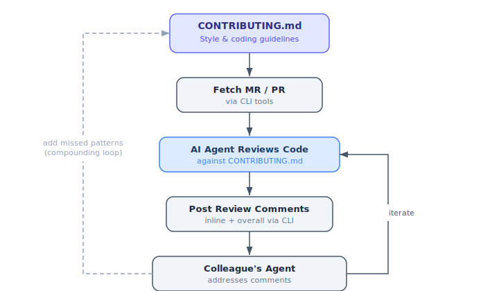
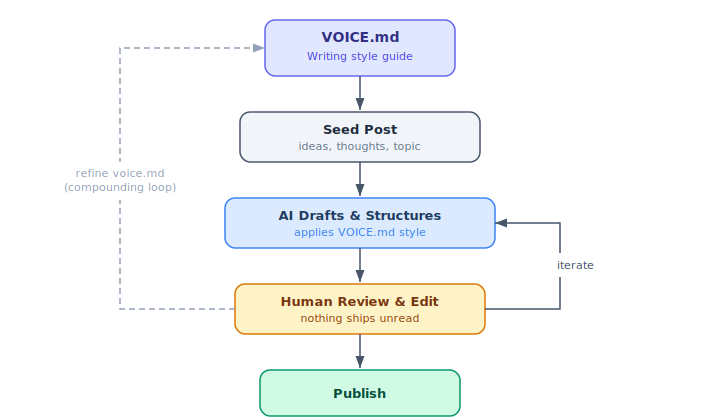

:::: {.callout-note appearance="minimal"}
## ✍️ *Writing a polished blog post takes a lot of time.*
::::

I've been noticing more and more that my writing output is mostly constrained by execution (i.e. the actual writing of the blog post) rather than by the ideas I want to write about. I have a lot of observations, best practices, tutorials, and learnings I want to share, and the bottleneck for publishing is writing the post - not generating ideas or doing the actual implementation work my posts are based on.

My recent project [NemoClaw Escapades](https://github.com/dpickem/nemoclaw_escapades) in particular has made me acutely aware of this bottleneck. Claude can help me iterate on the design and crank out the implementation, but when it comes to writing the blog post it either generates AI slop that sounds like a sales pitch or completely dry design doc-style posts that I barely want to read myself.

A few aspects in particular limit my writing output:

- Most of my posts are educational in nature, and as with all good teaching materials, they require a lot of thought for structure and content.
- All AI assistants write in their own particular style (most of which sound like they have been tuned for marketing and sales applications) which has very little overlap with my own writing style. It's important to me that my writing is authentic - I don't want to contribute to the sloppification of the internet. So authenticity and speedy publishing stand in direct conflict.
- Moreover, the most recent models have not been fine-tuned for high-quality prose writing but instead focus on verifiable tasks like code generation. High-quality prose writing, on the other hand, is subjective and usually requires a reward model for tuning (which in itself is subject to differing human preferences). So relying on AI to speed up my writing has not been feasible until now.

Just as with software engineering (at least until recently), I'm constrained by execution rather than ideas. It occurred to me recently to apply what I've learned from completely rewiring my software engineering workflows to my writing. I am converting the process of writing into an engineering problem - somewhat.

# A Parallel to Software Engineering

Before setting up my new and streamlined writing process, I want to briefly introduce my workflow for generating high-signal, AI-generated code reviews. It'll become clear in the next section why that software engineering practice matters for writing.

1. **Formalize the guidelines.** I may have finally found a good solution for having AI assistants provide high-signal code reviews - formalizing repo-specific guidelines (style and coding patterns) in a CONTRIBUTING.md file (see for example the [CONTRIBUTING.md](https://github.com/dpickem/nemoclaw_escapades/blob/main/CONTRIBUTING.md) for NemoClaw Escapades) that I can feed into my review agent. If the agent misses any key aspects in the review, I can add them to the CONTRIBUTING.md file and it improves the next cycle. So far, this setup has been working pretty well and produces reviews I am comfortable posting under my own name.
2. **Let the agent review.** My workflow is to use CLI tools to fetch a merge request / PR, have my agent review it according to these guidelines, and use another CLI tool for posting the comments (both inline and overall MR comments to a GitHub / GitLab style interface).
3. **Iterate until done.** My colleague's agent (or another one of my own agents) then picks up those comments and addresses them, and we iterate until the code is done.
4. **Compound the learnings.** What makes this process so powerful is that it compounds naturally - anything this loop misses just gets added to the CONTRIBUTING.md file for the next cycle.



In a sense, this is a fully agentic workflow for generating code of sufficient quality to ship to production - an iterative loop that is reminiscent of [Generative Adversarial Networks](https://en.wikipedia.org/wiki/Generative_adversarial_network) which pit a generator against a discriminator (similar to our code generator and code reviewer agent).

# Extracting My Writing Style

I am trying to apply this same pattern to writing blog posts. Step 1 of the process formalizes the style guide, so to speak. My starting point is the [VOICE.md](../../VOICE.md) file which aims to capture my writing style. To create that file, I asked my agent to do the following:

```
Create a new VOICE.md file that analyzes past posts to extract features
about how I write, the phrases I use, sentence constructions, vocabulary,
flow, post setup, etc. Use only blog posts that are on the main branch
and have been published. Only use posts up to the end of 2025.
```

I was not sure what to expect since the analysis was based on just 13 posts (only 6 of which are blog posts and 7 are heavily annotated Jupyter notebook tutorials). Surprisingly enough, the result was a pretty accurate description of my writing style for both blog posts and Jupyter notebook tutorials. There may be some confirmation bias on my part but I'll roll with it for now.

A few observations and notes about this analysis:

1. I asked it to analyze my posts from 2025 only because I wrote those completely without the help of any AI tools. During 2026, I've been guilty of including more and more AI-written components. I don't want those to pollute my voice file.
2. The agent identified a natural split of my posts into two types - descriptive blog posts and tutorials. It also identified specific attributes for both of those.
3. I won't repeat the full analysis here (see [VOICE.md](../../VOICE.md) for that), but I do want to highlight the categories of findings.

For example, the analysis reveals the overall tone of my posts as:

- **Conversational and personal**
- **Enthusiastic but measured**
- **Opinionated yet humble**
- **Reflective**

But the analysis also contains insights about my preferred sentence constructions, characteristic phrases, vocabulary, post structure and flow, structural motifs, and my characteristic sign-offs. Here are a few cherry-picked examples I found particularly accurate:

**Sentence construction** — the analysis picked up on my tendency toward long, clause-rich sentences with parenthetical tangents:

> "…which was the style at the time (this is 2012 onwards but pre-ChatGPT)."

**Characteristic phrases** — it identified my go-to transitions and deferrals, like "but that's a topic for another post", "More specifically", and "Last but not least." It even flagged my hedging patterns:

> "I did not exactly know what to expect"
>
> "I've been somewhat skeptical"

**Structural motifs** — the analysis named patterns I hadn't consciously noticed, like always opening with personal context, consistently including an "honest limitation" section, and crediting other people's work generously.

**Closing pattern** — it correctly identified my signature sign-off: *"Stay curious,"* followed by *Daniel* on a new line.

The full [VOICE.md](../../VOICE.md) file is an interesting read (but I suspect more so for myself than for others).

# Treating Blog Writing Like Software Engineering

Going forward I will treat blog writing more like software engineering. More specifically (and that's apparently one of my favorite phrases), I'll have AI assist me in writing posts but refine the loop to prevent it from slopifying my output:

1. **Seed the post.** Start with the ideas and thoughts I want to write about plus an overall topic.
2. **Let AI draft and structure.** Have AI formulate the post, add structure to it, and then use my new Cursor rule (`/danify`) to apply my VOICE.md file to the output.
3. **Review everything personally.** Just as I treat software engineering, nothing makes it into prod without me reading it first (yes, even in the age of AI-generated code and code reviews I read all code I commit - call me old-fashioned).
4. **Iterate until it's mine.** I'll read and iterate on the entire post until it represents me better and I am comfortable publishing it under my name.
5. **Compound the learnings.** Anything that feels off gets fed back into VOICE.md, just like with CONTRIBUTING.md.

Does this capture my entire voice? Definitely not. It is very specific to my style of writing blog posts and tutorials. But it seems like a handful of manually written pieces of a given type are sufficient to extract the writing style for that type. So if I ever venture out into - say - writing short stories, I'll definitely have to write a few of those by hand to capture my voice for that kind of writing.



# Where Does This Leave Us with Authentic Writing in the Age of AI?

## The Concerns

I have been a lot more hesitant to include AI-assisted writing in my prose. **It feels like I am giving up my authentic self in favor of increased output.** But I realized that my concern was not about using AI's help but more about producing AI slop that is of low quality, is not written in my voice, and lowers my standard (and possibly affects my reputation).

**Will this setup lock me into a style of writing?** The VOICE.md file contains my writing style as of the end of 2025. It's conceivable that my style will mature and change as I keep on writing. Using an AI assistant to apply my writing style from EOY 2025 to all my future posts has the potential of locking in my style prematurely and preventing it from maturing over time. That is definitely a concern with this approach and one I have to actively address. I don't have a better idea than to manually proofread all AI-generated output, keeping the proportion of AI-assisted writing small at first and only ramping it up as I become more familiar with the idiosyncrasies of that generation setup. I want to prevent losing my own voice, drowning it out, or just having it get stuck in 2025 when it could be living in 2026.

## The Opportunities

Just like with software engineering, **what I really need is not to manually write everything, but a compounding and improving quality control loop.** Similar to my CONTRIBUTING.md files, my new VOICE.md file is formalizing that self-improvement loop for my prose writing. While a lot of writers pride themselves on not using any AI assistance at all for their writing - **I will adopt AI assistance for writing but under carefully controlled conditions.**

Does this take anything away from us as human writers? I used to think that way, but **I've slowly come to see AI assistance as leverage** not just for code but also for prose writing. Coming to terms with AI writing all my code on my behalf felt disempowering at first (after all, what was my contribution to software engineering if not writing code). But I view myself as operating at a more abstract level of the software engineering process - I am now the architect and designer instead of the implementer. And as uncomfortable as it is to let go of that same thinking for prose writing, I'll give it a fair try and hope my writing improves in terms of quality as well as output volume.

# Closing Thoughts

I expect this setup to take a few iterations (or rather a continuous refinement loop) to get right, but my goal is to preserve my voice, avoid AI slop, and finally have a way to bring all my thoughts and observations to paper (or the screen).

In the meantime, I'll leave you with a **provocative thought**: Much like the Turing test, if you can't tell whether a post was written by me or my AI assistant, does it really matter? The outcome is the same after all.

So with all this in mind, (I'll) keep writing, but I suspect that this will be (one of) my last fully manually written posts.

Daniel
