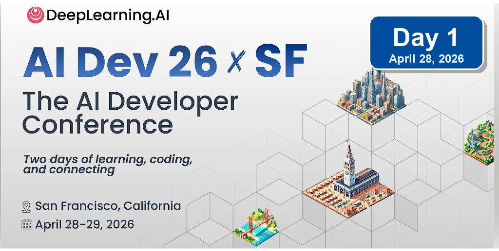

I've been a fan of Andrew Ng and his work, companies, and educational outreach ever since he started DeepLearning.AI. I've taken a few courses on DeepLearning.AI, and more recently I have been diligently reading his newsletter. So my natural next step was to attend DeepLearning.AI's [AI Dev 26 x SF - The AI Developer Conference](https://ai-dev.deeplearning.ai/), which took place at **Pier 48** in San Francisco, California (which is practically in my backyard).

Apparently I signed up for the conference in January and then completely forgot about it. So I was delighted to learn from my calendar last week that the conference was happening (announcements and reminders are definitely something DeepLearning.AI could improve on).

Like many recent conferences in the Bay Area, this one is heavily focused on AI agents (next-gen tools, observability, reliability, safety/security, evaluation, search and context, and many other topics). The conference runs three parallel tracks across two days.

I've split this recap into Day 1 and Day 2. Below, I summarize the sessions and presentations I attended. I tried to sample a range of topics across sessions. My initial plan was to mostly stick to stage 1, which had the most high-profile speakers. But throughout day 1, it became clear that I could derive more value from stage 2 or 3, which hosted more in-depth technical talks.

Day 1 had the classic conference structure: a morning plenary session with keynotes and a panel, followed by two afternoon breakout blocks across different stages. Day 2 had three breakout blocks. My notes below follow that same structure. I also realize this post has become quite lengthy. So if you only want the high-level summary of learnings and takeaways, you can read the [Overall Reflections](#overall-reflections) section and still get a pretty good idea of what the conference was about.

## Overall Reflections

### Location

Pier 48 is a cool venue. It has a more industrial and dated feel than Fort Mason, where OpenAI Dev Day was hosted, but it worked well for a large developer conference. It was also fun to see Andrew Ng in person. I have been following his work since the early DeepLearning.AI days, and he is always a pleasant and calm presence who acts as a counter-balance to all the hype around AI.

::: {.photo-carousel}
:::: {.carousel-track}
{group="ai-dev-impressions"}

{group="ai-dev-impressions"}

{group="ai-dev-impressions"}

{group="ai-dev-impressions"}

{group="ai-dev-impressions"}

::::
:::

### Quality of talks

The conference presented talks on a spectrum. On one end were the super technical, hands-on sessions: implementation details, architecture patterns, frameworks, failure modes, and lessons you could take away and apply to your own agent systems. On the other end were high-level, directional talks: where the industry is headed, what the big challenges are, what current approaches look like, and where the frontier seems to be moving.

In my opinion, the strongest talks occupy these ends of the spectrum (and this was true for the good talks at this conference as well). Some of the weaker talks sat in the awkward middle: too product-portfolio-heavy to be useful as engineering guidance, but too shallow to work as a high-level synthesis. A few sessions felt more like startup or platform advertising than technical talks. That said, there were also several genuinely useful sessions - especially around durable agents, agent memory, context engineering, and multi-agent communication. Overall, I found the quality of talks higher on the second day of the conference.

### Booths and Companies

Usually I check out most booths by just walking through the booth areas and letting the posters and booth materials draw me in. At this conference, I let some of the talks inspire my booth/company selection. Michael Kirchhof captured that strategy nicely in a [recent LinkedIn post](https://www.linkedin.com/posts/michael-kirchhof_advice-for-iclr-or-any-other-conference-share-7453028680550805504-fnCH?utm_source=share&utm_medium=member_desktop&rcm=ACoAAAP-zNkBZtOHQStBzAyYIqo_b2UGrJEp0uo): `Don't collect posters. Collect understanding.`
Based on the technical presentations I attended, I identified a few booths and companies I wanted to follow up on (most of them directly relevant to my [NemoClaw Escapades project](https://github.com/dpickem/nemoclaw_escapades/)):

- **Apify** - tools for agents
- **Temporal** - durable execution
- **Tavily** - web search tools
- **Strands Agents** - agent framework
- **BAND / Thenvoi** - universal communication layer for agents

### Recurrent themes

At the higher level, the conference kept circling around a few strategic shifts:

- **Speed changes the bottleneck.** Once agents make code generation faster, the limiting factor moves to planning, review, testing, CI, product judgment, and the surrounding organizational loops.
- **Safety has to live outside the model.** The strongest safety talks converged on the same point: prompts and model self-restraint are not enforcement layers, so agents need deterministic policy, sandboxing, scoped credentials, and auditable tool boundaries.
- **Context is king.** Whether the topic was memory, search, enterprise data, or coding agents, most useful systems came down to getting the right context into the loop without letting it rot or bloat.
- **Agents are becoming infrastructure.** Durable execution, observability, egress controls, MCP catalogs, and agent-to-agent communication all point toward agents being treated less like chatbots and more like distributed systems components.
- **Model choice should remain flexible.** Several speakers made the case that the best model changes too quickly to hard-code a single provider, and that different models already appear to specialize across planning, implementation, design, and review.
- **Review and verification are the next hard problems.** If agents can produce more code and more artifacts, teams need better automated review, stronger evals, faster tests, and deterministic quality gates to avoid turning velocity into unchecked complexity.

At the implementation level, the recurring topics were more concrete:

- **Observability and tracing.** Agent systems need traces that capture the full tool-calling and sub-agent tree, not just the final answer, so teams can debug failures and build eval datasets from real behavior.
- **Memory engineering.** Long-horizon agents need ways to record, retrieve, summarize, and forget information across sessions without turning every run into an ever-growing context dump.
- **Context management.** The practical question is not "how big is the context window?" but how the harness composes the right files, history, tools, plans, and task state into a useful working set.
- **Evals and regression suites.** Every production agent needs offline and online evals, stable invariants, shadow deployments, and rollback criteria so prompt/model/tool changes can be tested like software changes.
- **Sandboxing and scoped access.** Agents need isolated workspaces, network controls, short-lived credentials, and policy enforcement around tool calls, especially as they gain write access to real systems.
- **Durable execution.** Agent workflows need retries, state persistence, event history, and replay so a failed LLM call, tool call, or process crash does not force the whole task to restart.
- **MCP and tool governance.** Enterprises need a managed catalog for tools, auth, budgets, and permissions so developers can move fast without every agent becoming an ungoverned privileged user.
- **Agent-to-agent communication.** Multi-agent systems quickly become distributed systems problems: routing, message ordering, identity, persistence, and continuity all need explicit infrastructure.

### The future of the software engineer

A number of keynotes, panel discussions, and talks focused on what it means to be a software engineer in this day and age: how the job function changes, which skills remain relevant, and which skills matter less than they used to. The better version of this argument (which you also often hear on X) is not that software engineers disappear, but that the job moves up a level of abstraction. The work shifts from typing code toward setting direction, decomposing ambiguous problems, designing systems, choosing constraints, evaluating outputs, and owning the consequences of what agents build.

The durable traits look familiar, but become more important:

- **Systems thinking** - understanding architecture, boundaries, failure modes, latency, security, and operational constraints (this particular point reminded me of books like [Machine Learning System Design Interview](https://www.amazon.com/Machine-Learning-System-Design-Interview/dp/1736049127/), [Generative AI System Design Interview](https://www.amazon.com/Generative-AI-System-Design-Interview/dp/1736049143/), and the classic [System Design Interview - An Insider's Guide: Volume 2](https://www.amazon.com/System-Design-Interview-Insiders-Guide/dp/1736049119/)).
- **Curiosity about the world** - the strongest builders seem to be naturally interested in how things work, what customers need, and where tools are headed.
- **Learning ability and growth mindset** - nobody is truly keeping up with the entire space; the useful skill is learning quickly, staying humble, and jumping into new tools without treating the frontier as fixed.
- **Reflection, not tokenmaxxing** - slowing down to process what you learned matters more than squeezing every last token out of the day and passing out at your computer at 3am.
- **Deep domain understanding** - agents can generate generic output, but useful engineering still depends on knowing the domain well enough to notice when an answer is shallow, wrong, or misapplied.
- **Technical fluency** - you still need to learn the underlying technology, systems, and constraints; the abstraction level moves up, but the need for real understanding does not disappear.
- **Critical thinking and truth-seeking** - models can hallucinate, contradict themselves, or confidently lie, so engineers need to keep digging until they know whether the answer is actually true.
- **Product and customer fluency** - developers increasingly need to talk to customers, understand product trade-offs, and own outcomes rather than just implementation tasks.
- **Automation mindset** - good engineers will keep spotting rote workflows and turning them into tools, scripts, agents, or durable processes.
- **Agent management** - if we effectively have an infinite workforce, the question becomes whether you micromanage every worker or learn to manage agents thoughtfully through goals, constraints, review, and delegation.
- **Communication about learning** - sharing what you tried, what worked, and what failed becomes part of the job; this resonates strongly with why I write posts like this one. Part of this is also documenting what you learn in a formal and shareable manner (not just for humans, but increasingly also for agent consumption - think agent skills).
- **Taste** - Joe Reis called out taste as something you build through experience, exposure, and seeing many implementations and designs over time.

The junior-engineer story is the least settled. Agents may let junior engineers take on harder work earlier, but they also threaten the old entry-level learning path where people built judgment by doing small implementation tasks. That makes mentoring, code review, and explicit teaching of engineering judgment more important, not less. In my opinion, the fate of future junior engineers was the weakest part of the argument. AI tools can speed up learning for new graduates, but they do not replace the experience people gather by working inside real companies, with real codebases, real customers, and real constraints. I think the industry has to be careful not to remove the first stage of the talent pipeline - or at the very least reimagine what that first stage looks like.

Besides the [Future of Software Engineering panel](#panel-discussion-future-of-software-engineering) on the first day, Brandon Middleton's [Vibe Coding Master Class](#vibe-coding-master-class---brandon-middleton-replit) was also highly relevant to this question.

---

## Conference Schedule At A Glance

The full conference schedule is available on the [AI Dev 26 x SF website](https://ai-dev.deeplearning.ai/). For Day 1, I focused on the morning plenary, then moved between the agent tooling, memory, search, reliability, and multi-agent tracks in the afternoon. Day 2 was organized around three breakout blocks across the same three-stage format.

**Day 1 - April 28**

| Time | Session | Tracks / Focus |
|---|---|---|
| Morning | Plenary session | Opening remarks, future of software engineering, agent safety, context/data layer, panel discussion, Google DeepMind, Andrew Ng keynote |
| 1:00 PM - 3:15 PM | Breakout Session 1 | Next-gen tools, agent observability/evaluation/security, agent search and context |
| 3:30 PM - 4:55 PM | Breakout Session 2 | Agent memory engineering, agent data foundations, agent reliability and durability |

**Day 2 - April 29**

| Time | Session | Tracks / Focus |
|---|---|---|
| 9:00 AM - 11:30 AM | Breakout Session 1 | Stage 1: Software Development in the Age of GenAI - 1; Stage 2: Enterprise Agents in Production; Stage 3: Agent Integration, Access and Security |
| 1:00 PM - 3:15 PM | Breakout Session 2 | Stage 1: Software Development in the Age of GenAI - 2; Stage 2: Agent Actions and Interfaces; Stage 3: Agent Context and Memory - 1 |
| 3:30 PM - 5:30 PM | Breakout Session 3 | Stage 1: AI Systems; Stage 2: Foundation Models; Stage 3: Agent Context and Memory - 2 |

---

## Day 1 - April 28, 2026

{fig-alt="AI Dev 26 x SF conference graphic with Day 1 overlay"}

### Morning Session - Keynotes And Panel

The morning session set the frame for the conference: AI is changing software engineering, agentic systems need better safety and reliability boundaries, and context/memory/data systems are becoming the real substrate of useful AI applications. The best morning talks were the ones that connected the big picture to concrete engineering patterns: speed as a moat, defect rate as the limiting factor, deterministic policies around agents, and the collapse of engineering and product work into a more AI-native builder role.

#### Opening Remarks - Jonathan Heyne, DeepLearning.AI

Jonathan Heyne opened the conference with a few stats about the attendee community:

- Attendees came from **62 countries**, **319 cities**, and spoke **95 languages**.
- Self-rated skill breakdown was **27% beginner**, **47% intermediate**, and **26% advanced**.
- About **65%** of attendees either work at startups or want to work at startups, compared with **35%** focused on enterprise.
- The strongest topic interest was around **agentic AI**, **AI coding**, **context engineering**, and **AI startups**.

The most useful framing was that a lot of learning at conferences happens outside the planned sessions: hallway conversations, random encounters, booth demos, and follow-up threads with people working on similar problems.

#### The Future Of Software Engineering - Anush Elangovan, AMD

**My take:** The strongest idea in this talk was that `speed is the actual moat`, meaning that teams can move from idea to implementation to demo to product outcome much faster than before, and the limiting factor shifts from typing code to thinking forward clearly enough to keep parallel work streams moving.

Anush Elangovan framed the future of software engineering as a **K-shaped future**. The higher-value work moves toward systems-level thinking, first-principles reasoning, higher-level design, and product/business outcomes. The lower-value work is the mechanical implementation layer: writing the obvious code, wiring things together, and handling details that agents can increasingly manage.

He made the point that engineering outcomes should not be measured in lines of code. They should never have been measured that way. The right measure is whether engineering work produces the intended business outcome.

The core theme was speed:

- How quickly can you take an idea to implementation, demo, product, or measurable outcome?
- The industry is moving so quickly that what felt bleeding edge last week may already feel normal this week.
- Singular throughput is not enough; the goal is continuous throughput. You have to set up your workflows and processes in a way that you can ship at a certain speed continuously and not just as a one-off.
- Winners operate in parallel, not sequentially (I think this mostly pertained to how you run your agents or your experiments - multiple shots at once)
- You become limited by your ability to think forward, not by your ability to write code.

The second half of the talk covered AMD's ROCm strategy:

- **AI Assist** for automated GPU programming
- Open source as a way to drive rapid innovation
- Higher-level abstractions to avoid forcing developers into low-level GPU code
- The claim that frontier models increasingly understand AMD's stack end-to-end

Projects mentioned:

- **GEAK** - Generating Efficient AI-Centric Kernels, an agent loop that iterates on kernel design for customers
- **HotSwap** - automated translation from one machine ISA to another
- **llama.cpp optimization for HIP** - a new runtime with roughly 100 custom kernels
- **IREE Tokenizer** - a tokenizer implementation targeting 10M tokens/sec, described as the fastest tokenizer worldwide, written in C with Rust and Python bindings

The closing message was direct: wherever there is compute, AI will consume it, including your laptop. His advice was to lean into agentic AI because the future is coming fast.

::: {.photo-carousel}
:::: {.carousel-track}
{group="amd-future-software"}

{group="amd-future-software"}
::::
:::

#### The Sorcerer's Apprentice Problem: Why Agent Safety Lives Outside The Agent - Marc Brooker, AWS

**My take:** This was one of the more useful high-level talks because it gave a crisp systems framing: the opportunity for agents is limited by their defect rate. If agents are going to become infrastructure people and businesses depend on, safety cannot live inside the model prompt alone. It has to live in deterministic systems around the agent.

Marc Brooker is a VP and distinguished engineer at AWS and writes at [brooker.co.za](https://brooker.co.za/blog/). He started from the premise that this is the most exciting time of his software engineering career, but his main hypothesis was sober: **the opportunity for agents is limited by the defect rate**.

He emphasized **feedback loops as one of the most powerful ideas in science and technology** (which is a statement that resonated deeply with me since I am trying to find automatable loops everywhere). Agents are feedback-loop machines, but that also means their failures can compound unless the surrounding system constrains and checks their behavior.

AWS is approaching this with several layers:

- **Correct-by-construction frameworks**: Hydro, a Rust framework for writing correct distributed systems and protocols, and Cedar, a policy language for authorization with deep roots in automated reasoning
- **Spec-driven development and testing**: using specs to make intended behavior explicit and testable
- **Automated reasoning and proof**: Strata as an intermediate language and Lean as a proof system/language increasingly used across the reasoning model ecosystem
- **Autoformalization**: applied in systems like Amazon Bedrock AgentCore and Amazon Bedrock Guardrails
- **Deterministic agent and tool policy**: AgentCore, trusted remote execution, and Strands-style policies encoded as pre- and post-conditions around tool calls

One of the key points was that current models are not especially strong at reasoning through concurrency and distributed failure modes. Instead of asking the model to be perfect, the system should let the model do what it is good at while deterministic layers verify and validate its inputs and outputs.

The broader industry challenge is raising standards. It is not enough to report aggregate failure rates; benchmarks need to capture **failure severity**, not just frequency. The failures that matter most are the ones that cause real damage.

::: {.photo-carousel}
:::: {.carousel-track}
{group="aws-agent-safety"}

{group="aws-agent-safety"}

::::
:::

#### Engineering The Context Layer: Vector Databases Across Cloud, Edge, And On-Prem AI - Emma McGrattan, Actian

**My take:** This talk felt fairly high-level and somewhat dated. The premise that enterprise agents need access to business data is obviously right, but the proposed path was still mostly RAG and similarity search. That framing does not fully reflect where agentic search and context engineering seem to be moving. Nonetheless, I appreciated the slide deck, which provided a lot of detail but also a great overview of deployment options and a comparison between cloud, on-prem, and edge-based deployments.

Emma McGrattan, CTO of Actian, focused on the data and context layer for enterprise AI. The basic premise was that LLMs know nothing about your business by default, so you have to give them reliable access to business data. She then addressed the question of how to engineer that data layer reliably and at scale.

Key points:

- Enterprise data is fragmented across many systems. Gartner estimates the average enterprise has around **400 data sources**.
- Data has gravity: where data lives affects latency, governance, cost, and architecture.
- The US Patriot Act was mentioned as a reason some organizations care deeply about where data is physically stored.
- Vector databases and similarity search were presented as the primary mechanism for injecting business intelligence into model context.

The framing was directionally correct, but it felt like it stopped at "RAG plus vector DBs." That is useful, but not sufficient for the kinds of long-horizon agent systems people are now building.

::: {.photo-carousel}
:::: {.carousel-track}
{group="actian-data-layer"}

{group="actian-data-layer"}

{group="actian-data-layer"}

{group="actian-data-layer"}

{group="actian-data-layer"}
::::
:::

#### Panel Discussion: Future Of Software Engineering

**My take:** Parts of the panel felt behind the frontier. At Anthropic, OpenAI, and increasingly inside large engineering organizations, the frontier has already moved beyond basic "vibe coding." Agents do not just generate code; they review it, test it, create artifacts as proof of work, debug issues, and even merge PRs to production. The idea that agents mainly produce AI slop that humans then have to painstakingly debug feels outdated. The best current models are already extremely strong debugging partners and often find bugs and edge cases faster than humans.

Panelists:

- **Michele Catasta**, Replit
- **Dan Maloney**, LandingAI
- **Richmond Alake**, Oracle
- **Joe Reis**, Practical Data Media
- **Marina Mogilko**, Silicon Valley Girl, moderator

The panel opened with the question of which jobs are disappearing. The consensus was that software engineering is not disappearing, but the work is moving to a more abstract level. Engineers are becoming orchestrators of agents, systems, and product direction (which is a fairly common opinion in the industry).

Recurring themes:

- Critical thinking is becoming more important, not less.
- Junior engineers may advance faster because agents expose them to higher-complexity work earlier.
- The career ladder may compress: juniors get "burned daily" by harder problems and learn faster.
- AI-native adoption may be an advantage for junior developers who are less beholden or attached to older workflows or ways of working.
- Agents need memory to work on long-horizon tasks.
- Data quality and semantic modeling still matter; connecting an AI directly to a production database is not a strategy.

Richmond Alake discussed different forms of memory:

- Procedural memory
- Working memory
- Episodic memory
- Semantic memory

The interesting memory-system point was that agents need efficient ways to **record**, **retrieve**, and **forget** information. Long-horizon tasks require all three.

Joe Reis pushed back on the idea that companies can speed-run the data story. His warning was essentially: do not slap an agent on top of a production database and hope that gives you a data strategy. You still need a data model and a semantic model. The line that stuck with me was:

> We do not have enough time to do it right, but we have time to do it over.

On future skills, the panel emphasized:

- Curiosity
- Learning ability
- Deep domain understanding
- Technical skill
- Critical thinking
- Product sense
- Automation mindset
- Communication about what you learn
- Taste, built through exposure to many systems and designs

Michele's strongest point was that truth-seeking becomes a core skill. Models may hallucinate, contradict themselves, or confidently assert wrong things. You need to keep digging until you understand whether the answer is actually true.

On the generalist-versus-specialist question, the most compelling answer was that both expand: generalists become broader, specialists become deeper, and specializations refresh on much shorter timelines. A specialization may no longer last decades but may need to be updated every few months or years. The concrete takeaway was that engineering work becomes more judgment-heavy at the same time that the surrounding systems become more technical. You need enough generalism to connect product, data, AI, and systems concerns, but enough specialization to know when the generated answer is wrong, incomplete, unsafe, or built on a weak premise.

::: {.photo-carousel}
:::: {.carousel-track}
{group="future-software-panel"}
::::
:::

#### Research To Reality With Google DeepMind - Paige Bailey, Google DeepMind

**My take:** This talk was mostly a run-through of Google's AI product portfolio. This is something I can easily find in AI newsletters or on Google's blog, so I was hoping for more from this talk.

Paige Bailey, AI developer relations lead at Google DeepMind, framed Google's mission as building AI responsibly to benefit humanity. The core product direction was multimodality: models need to interact with the world, not just text.

Products and systems mentioned:

- **Gemini 3** and model variants: Pro, Flash, Flash-Lite, and Nano
- **Gemma 4**, the new open model family, with 2B, 4B, 26B MoE, and 32B dense variants
- Stanford's "Pupper" family of robots and models, described as free and 3D printable
- AR and glasses work, including capabilities for their own glasses and partner devices like Ray-Ban-style form factors
- Real-time speech translation
- World models
- Nano Banana for image generation / Veo for video generation
- Genie 3 for natural-language-generated playable worlds
- Antigravity, Google's coding platform (**75% of merged code at Google is AI-generated**, facilitated by Antigravity)

::: {.photo-carousel}
:::: {.carousel-track}
{group="google-deepmind"}

{group="google-deepmind"}

{group="google-deepmind"}

::::
:::

#### AI Coding, Context Hub, And Codream - Andrew Ng, DeepLearning.AI

**My take:** Andrew's core argument was that when software engineering gets 10x or 100x faster, every adjacent function becomes the bottleneck. Code review, product management, design, legal, and marketing all have to become more AI-native too. The most interesting claim was that the engineer/PM boundary may collapse into a single AI-native builder role.

Andrew Ng's keynote centered on AI coding and the changing shape of software teams. His starting point was that we now have many useful building blocks: models, tools, frameworks, APIs, coding agents, and context systems. AI coding lets us assemble those building blocks faster.

One of the most interesting slides he showed was a comparison of time spent on software engineering when 80% or 100% of the code is written by AI. His argument was that the remaining 20% of manual coding can take up such a large share of your time that you do not fully realize the benefits of AI-based code generation. He asked: how much code should we write with AI? His answer for his own work was blunt: **100%**.

The next bottleneck, in his view, is no longer code generation. If humans must review every piece of generated code, code review becomes the bottleneck. So code review itself needs to become automated. All of these automations just push the bottleneck to the next feedback loop or organizational function:

- Product management bottleneck
- Design bottleneck
- Legal/compliance bottleneck
- Marketing bottleneck

When software engineering speeds up dramatically, all of these functions struggle to keep pace. He described using AI to draft legal briefs and then having a real lawyer review and sign off, which is a useful pattern: AI does the first pass, humans handle accountability and final judgment (which is how I view software engineering as well - AI writes and reviews the code but responsibility ultimately remains with the human engineer).

Andrew described the emerging **AI engineer** role as a combination of:

- Skillful use of coding agents
- Robust knowledge of AI/software building blocks
- Basic product management
- Judgment about both how to build and what to build

He also announced **Codream**, available in preview as of today at [codream.ai](https://codream.ai/). Codream is a voice-first software development environment: you talk to the system, develop software through natural conversation, and interact with what looks like an online IDE.

::: {.photo-carousel}
:::: {.carousel-track}
{group="andrew-ng-codream"}

{group="andrew-ng-codream"}

{group="andrew-ng-codream"}

{group="andrew-ng-codream"}

{group="andrew-ng-codream"}

{group="andrew-ng-codream"}

{group="andrew-ng-codream"}

{group="andrew-ng-codream"}
::::
:::

---

### Breakout Session 1 - Next-Gen Tools, Agent Memory, Search, And Context

The schedule split across three major tracks: **Next-Gen Tools**, **Agent Observability, Evaluation & Security**, and **Agent Search and Context**. This looked like one of the strongest Day 1 blocks. I spent most of it in the hands-on tooling and memory sessions, with a stop in the Chroma session on agentic search.

One talk I could not attend because it was in parallel was Harrison Chase's **The Observability Flywheel: From Traces to Continuously Improving Agents**. Based on the audience reaction I heard from nearby rooms, this is one to check out if the recording becomes available.

#### Building Personal AI Agents With Open-Source Models - Eda Zhou And Mahdi Ghodsi, AMD

**My take:** Sadly, the Wi-Fi did not work well enough for me to go through the hands-on Jupyter notebook live. These are definitely worth checking out (if and when they are made available online). After signing up for the AMD developer program, you can run these tutorials in AMD's cloud environment using up to $100 in GPU cloud credits.

This workshop focused on building, shaping, and extending an **OpenClaw** agent on AMD hardware. The setup ran on **MI325X GPUs** and used **vLLM** to serve an open-source model (a Qwen 122B MoE model) on AMD hardware via ROCm.

The opening framing was a useful reminder:

- An LLM on its own can generate text, but it cannot correct, verify, or test its own output.
- An agent is roughly: **LLM + memory + planning + actions/tools**.
- This maps to the basic ReAct loop: reason, action, observation

The presenters broke an agent into three components:

- **Model** - the inference engine
- **Runtime** - manages the loop, context, tool calls, retries, and state
- **Tools** - external capabilities the agent can call

The hands-on stack:

- vLLM serving `Qwen3.5-122B-A10B-FP8` on AMD hardware via ROCm
- Tool calling enabled through vLLM arguments
- REST interaction with the vLLM server via `urllib`
- OpenClaw configured to use vLLM as the model/auth provider

OpenClaw uses a very file-oriented setup - markdown files track identity, user state, "soul", tools, skills, and other persistent assistant context. OpenClaw is not a coding agent specifically; it is more of a general-purpose personal agent framework.

Two demos stood out:

1. Debugging an example GitHub repo, then turning that debugging workflow into a reusable skill (a `pytest-debugger` skill).
2. A 2D pixel office UI for visualizing agents, including a Kanban board of tasks and an "Agent Office" style interface (the UI looked similar to OpenClaw's web-based dashboard).

The multi-agent setup was also interesting. OpenClaw can create named agents and invoke them from the main agent. One example was a **morning brief agent** that watches a set of GitHub repos, filters PR noise, and summarizes the important updates for the user. I've installed OpenClaw on a local machine before, but this talk was the push I needed to complete the setup and focus on instantiating a first use-case.

::: {.photo-carousel}
:::: {.carousel-track}
{group="amd-openclaw"}

{group="amd-openclaw"}

{group="amd-openclaw"}

{group="amd-openclaw"}

{group="amd-openclaw"}

{group="amd-openclaw"}

{group="amd-openclaw"}

{group="amd-openclaw"}

{group="amd-openclaw"}

::::
:::

#### Hands-On Agent Context And Memory Engineering With Oracle AI Database - Eli Schilling, Oracle

**My take:** The tutorial seemed a bit dated. It referenced `gpt-3.5-turbo`, which has been deprecated for a while, and the architecture felt very close to classic RAG: embed chunks, store them in vector tables, and retrieve by similarity search. The six-layer memory system was interesting, but the implementation felt less current than agentic search and filesystem/context-oriented approaches. Nonetheless, the talk contained a few interesting slides that introduced agent memory at a higher level that I found quite useful.

The workshop ran in Oracle Codespaces and required setting up an Oracle API key and a Hugging Face token. If you are curious, you can check out the Jupyter notebooks and tutorial files in this repo: [oracle-ai-developer-hub agent memory workshop](https://github.com/oracle-devrel/oracle-ai-developer-hub/tree/main/workshops/agent_memory_workshop/workshop).

The opening question was: why do AI agents need memory?

Without memory, agents:

- Forget every session
- Contradict themselves
- Repeat the same mistakes
- Cannot execute long tasks

With memory, agents can:

- Persist state across sessions
- Make more consistent decisions
- Learn from experience
- Execute long-horizon tasks

One useful slide compared context-window growth for naive versus engineered agents. Naive agents keep stuffing more tokens into the context over time. Engineered agents manage context deliberately and use memory systems to keep the working set smaller and more relevant. The exact numbers matter less than the takeaway here: Context is something that should be actively managed to avoid context bloat and deteriorating performance as the context grows (this is an aspect of harness engineering that all major harnesses invest a lot of time and resources into, e.g. Claude Code, Codex, Hermes, OpenClaw, etc.).

The workshop separated three engineering disciplines:

- **Context engineering** - what the agent perceives
- **Memory engineering** - what the agent retains
- **Harness engineering** - how memory is orchestrated

The architecture used Oracle AI Database heavily. Most of the memory lived in database tables, many of them vector tables, plus a couple of SQL tables. Tool descriptions were also embedded and retrieved with semantic similarity search, which raised a performance/design question for me: if tool lookup itself becomes embedding search over tool descriptions, does that make tool selection slower and less deterministic than it needs to be?

Overall, the memory hierarchy can still serve as a useful reference for building your own memory system. However, I would not use the setup the way it was implemented in this workshop.

::: {.photo-carousel}
:::: {.carousel-track}
{group="oracle-agent-memory"}

{group="oracle-agent-memory"}

{group="oracle-agent-memory"}

{group="oracle-agent-memory"}

{group="oracle-agent-memory"}

{group="oracle-agent-memory"}

{group="oracle-agent-memory"}

{group="oracle-agent-memory"}

{group="oracle-agent-memory"}

{group="oracle-agent-memory"}

{group="oracle-agent-memory"}

{group="oracle-agent-memory"}

{group="oracle-agent-memory"}

{group="oracle-agent-memory"}

{group="oracle-agent-memory"}

{group="oracle-agent-memory"}

{group="oracle-agent-memory"}
::::
:::

#### Agentic Search: Everything You Need To Know - Jeff Huber, Chroma

**My take:** This talk lined up with a theme I keep seeing: most AI failures are not model failures, they are context failures. So context is something that should be actively managed and curated/composed.

Jeff Huber framed universal AI computers as **context + reasoning**. Agents are good at reading and writing context, but context quality determines whether the reasoning loop has a chance to work.

Key points:

- Agents need to read and write context, not just retrieve static snippets.
- Context rot is a real problem.
- Beyond some number of tokens, model performance deteriorates even if the model technically accepts the context.
- We do not need to over-curate every bit of context, but we do need better systems for composing it.
- Most AI failures are not model failures; they are context failures.

He presented a slide on multi-stage prompt composition that looked very similar to the staged prompt construction patterns I have been using in my own agent experiments: start with durable identity/instructions, add task state, retrieve relevant context, then compose the final working prompt (this is an approach I've seen all across the latest and greatest harnesses including Claude Code).

Chroma also announced **Chroma Context-1**, a 20B model for fast retrieval. The numbers mentioned were roughly **$1 per 1M output tokens**, **400 tokens/sec on Blackwell**, and **3,000 tokens/sec on Cerebras**.

::: {.photo-carousel}
:::: {.carousel-track}

{group="chroma-context-1"}

{group="chroma-context-1"}
{group="chroma-context-1"}

{group="chroma-context-1"}

{group="chroma-context-1"}

{group="chroma-context-1"}

{group="chroma-context-1"}

::::
:::

---

### Breakout Session 2 - Agent Reliability, Durability, And Multi-Agent Communication

Once again, the session was split into three tracks: agent memory engineering, agent data foundations, and agent reliability/durability. I focused on the reliability stage, which ended up being one of the most useful parts of the day. Temporal made the durability problem concrete, and Thenvoi/BAND connected multi-agent systems to distributed systems and communication infrastructure.

#### Your Agents Should Be Durable - Melissa Herrera, Temporal Technologies

**My take:** This started a little high-level, almost like "explain it to me like I am five," but it became more concrete and useful as the talk went on. It convinced me to try Temporal for agent workflows and check out their booth. The framing of agent steps as durable workflow activities and composing them into workflows is a powerful abstraction to handle the complexities of agentic systems. I'll definitely try to adopt some of that as part of my NemoClaw Escapades project.

Melissa Herrera's talk focused on a simple but important question: how do you make agents durable, and why should you care?

The key premise:

- Building an agent is easy if you define it as a tool-calling while loop.
- Making that agent production-ready is hard.

The failure mode she emphasized was familiar: an agent crashes and loses all context. Restarting from scratch is not ideal because it may redo inference calls, repeat tool calls, incur cost again, or lose progress.

Temporal's answer to this problem is **durable execution**:

> Durable execution guarantees your code executes to completion even in the face of failure.

The analogy was checkpoints in video games, but for code. Temporal wraps an agent workflow in a system that tracks state and event history:

- Agent steps become **Temporal Activities**, such as LLM calls and tool calls.
- Activities can be retried, and their state is tracked and persisted.
- Activities are composed into **Temporal Workflows**.
- Python SDK support uses decorators, so it looked like a structured async workflow setup with durable state and retries.

The demo made the idea more concrete:

- A local observability dashboard showed the workflow and activity state.
- When a failure happened, only the failed activity retried; it did not bring down the entire workflow.
- Temporal kept full event history.
- Temporal handled state before failures out of the box.
- Replay could reconstruct steps up until the failure and continue from there.
- OpenAI's Responses API can be wrapped as a Temporal activity and given retry behavior.
- One of the coolest parts of this demo was the web dashboard Melissa showed, which visualized the state of all workflow activities, whether they were retried, their success or failure state, all in a neat event timeline.

The production credibility point was that OpenAI uses Temporal for image generation workflows and parts of the ChatGPT backend.

::: {.photo-carousel}
:::: {.carousel-track}
{group="temporal-durable-agents"}

{group="temporal-durable-agents"}

{group="temporal-durable-agents"}

{group="temporal-durable-agents"}

{group="temporal-durable-agents"}

{group="temporal-durable-agents"}

{group="temporal-durable-agents"}

{group="temporal-durable-agents"}

{group="temporal-durable-agents"}
::::
:::

Links to follow up:

- [Temporal docs](https://docs.temporal.io/)
- [Temporal Python SDK](https://github.com/temporalio/sdk-python#gh-light-mode-only)

#### Herding Cats: The Hidden Challenges Of Multi-Agent Autonomy - Vlad Luzin, Thenvoi / BAND

**My take:** This was one of the most relevant talks of the day for multi-agent systems. The thesis maps directly onto a problem I keep running into: right now the human often acts as the message bus between agents - I keep shuffling messages between a coding and a review agent (or have them interact via the GitHub comment/conversation mechanism). A real agent-to-agent communication layer would let agents coordinate directly, persist sessions, route messages, and survive crashes. This may have been my favorite talk of the conference as it resonated the most with the problems I am working on in my own projects.

Vlad Luzin's talk was about BAND, a platform and SDK for agent-to-agent communication. The simplest description is: a universal communication layer for agents.

The talk had four parts all leading up to the central value proposition of BAND which provides a communication mechanism to tie a distributed set of agents together:

- Thesis
- AI evolution
- Technical challenges of multi-agent systems
- BAND platform and SDK

The opening thesis used customer support as the example:

- Yesterday: human-to-human communication
- Today: human-to-AI communication through voice agents and assistants
- Tomorrow: AI-to-AI communication, where each person and business may have its own assistant agents

He argued that the future of consumer-to-business, B2B, and intra-business workflows is AI-to-AI interaction. Natural language becomes the most flexible interaction schema, rather than hard-coded JSON schemas. Agents operate independently, make decisions, and collaborate without a human intermediary in every loop.

The developer view was even more interesting because it applies more directly to my day-to-day job:

- Today: a developer runs multiple Claude/Codex sessions and manually copy-pastes context between them.
- Tomorrow: agents converse with each other in real time.
- The ideal shape is a connected mesh of humans and agents that come together around a task.

He mentioned Linear as a strong task system for agent integration because of its API and workflow model (so I will definitely be trying that out).

The AI evolution slide was a useful taxonomy, or rather a historical timeline of capabilities:

- Sequential request/response processing
- Agentic workflows as graphs
- MCP-style protocol work for passing context and exposing tools
- Google's A2A protocol for agent-to-agent communication
- Skills as reusable prompt/context bundles
- Stateless distributed sub-agents that spawn and die
- Managed agents from Anthropic, OpenAI, Cursor, and others
- Autonomous distributed multi-agent systems

The key technical claim was that connecting remote agents is a distributed systems problem. An agent is like a microservice, except it is nondeterministic.

BAND tries to solve several layers:

- **Transport** - real-time delivery, push, ordering, queues
- **Continuity** - persistence, hydration, runtime binding
- **Conversation** - rooms, participants, routing, multi-party protocols
- **Governance** - identity, audit, tenancy, permissions, human ownership

The continuity point is especially important. If an agent crashes, it should not bring down the whole system. When it comes back, it needs to hydrate its session and continue. Different providers call this concept different things: session ID, thread ID, execution ID, and so on. A communication layer needs to map those concepts together.

BAND's platform promises:

- Registry of remote agents
- Channels
- State persistence
- Message filtering
- Security
- Observability
- Transport abstraction over WebSockets and REST

Vlad explicitly called out that BAND is not an SDK for creating agents but rather an SDK that lets existing agents participate in agent-to-agent communication.

::: {.photo-carousel}
:::: {.carousel-track}
{group="thenvoi-band"}

{group="thenvoi-band"}

{group="thenvoi-band"}

{group="thenvoi-band"}

{group="thenvoi-band"}

{group="thenvoi-band"}

{group="thenvoi-band"}

{group="thenvoi-band"}

{group="thenvoi-band"}

{group="thenvoi-band"}

{group="thenvoi-band"}

{group="thenvoi-band"}

{group="thenvoi-band"}
::::
:::

Follow-up:

- Check out the [Thenvoi GitHub repositories](https://github.com/orgs/thenvoi/repositories?type=all).
- Get in touch with Vlad and ask for the slides.

---

## Day 2 - April 29, 2026

{fig-alt="AI Dev 26 x SF conference graphic with Day 2 overlay"}

### Breakout Session 1 - Software Development, Enterprise Agents, And Agent Safety

I stayed in **Stage 1: Software Development in the Age of GenAI - 1**, mostly because it featured big-name talks from Cursor, Databricks, and Docker. This was probably the most practically relevant track of Day 2 because it focused on how coding agents are actually being deployed, governed, sandboxed, and integrated into engineering workflows.

#### 3rd Era Of Software Development: From Tab Completion To Cloud-Native Agent Factories - Amrita Venkatraman, Cursor

**My take:** This was partly a Cursor product walkthrough, but the cloud-agent features looked genuinely useful for day-to-day engineering work. The main idea was that coding assistants are moving from local, synchronous helpers toward teams of remote agents that can plan, execute, verify, and return rich artifacts. Every major lab seems to be enabling some version of cloud agents already, and the idea of decoupling agents from your local machine and making them truly async is a powerful force multiplier.

The framing followed the argument from Cursor's [third era of software development](https://cursor.com/blog/third-era) post:

- Era 1: manual coding, where engineers decompose problems into logic, functions, and files.
- Era 2: AI assistance through tab completion and in-editor agents.
- Era 3: AI teammates, where cloud agents can work in parallel on larger chunks of software work.

We are currently in a transition period between "agents" (stage 2) and "team" (stage 3). Amrita's claim was that agents don't just accelerate software engineering but that they lower the barrier between an idea and a working artifact which enables more people to become builders.

The agent architecture slide was one of the more interesting parts:

- A planner breaks down work into sub-plans.
- Worker agents execute pieces of the plan, potentially on separate feature branches.
- Different workers can use different frontier models because models have different strengths.
- OpenAI models were framed as strong planners, Claude as strong at implementation, and Gemini as useful for design-oriented work.
- Execution is moving from local delegation toward cloud execution, where agents run on remote VMs.

The demos showed a workflow that Cursor apparently uses internally:

- Launch a cloud agent whenever a feature ships so it can update documentation.
- Plan locally, then delegate execution to a cloud agent.
- Use sub-agents such as `/code-explorer` and `/devils-advocate` to make plans more robust.
- Ask the agent to interview the user when requirements are ambiguous.
- Have agents produce artifacts such as screenshots and screen recordings, not just diffs (to prove their work).
- Publish plans to GitHub or Notion for human comments, then edit the plan directly or ask the agent to revise it.

Cursor automations also looked promising. They are built on top of cloud agents and can be triggered by time, cron, GitHub/GitLab events, Slack messages, Sentry, PagerDuty, Datadog, and other systems via MCP. The notion of triggers that go beyond a user interacting with an agent was a recurring theme. A number of automations are event-triggered rather than human-triggered (Amrita went as far as saying that most agents should be triggered by something other than the human user).

::: {.photo-carousel}
:::: {.carousel-track}
{group="cursor-cloud-agents"}

{group="cursor-cloud-agents"}

{group="cursor-cloud-agents"}

{group="cursor-cloud-agents"}

{group="cursor-cloud-agents"}

{group="cursor-cloud-agents"}
::::
:::

Follow-up:

- Check out Figma as a slide deck tool, since her slides were in Figma.
- Look into Graphite and how it fits into code review workflows.
- Build local `code-explorer` and `devils-advocate` sub-agents.
- Check whether Cursor automations are available at NVIDIA.
- Read Cursor's [dynamic context discovery](https://cursor.com/blog/dynamic-context-discovery) post.
- Read Cursor's [third era of software development](https://cursor.com/blog/third-era) post.

#### The Coding Agent Multiverse Of Madness - Ankit Mathur, Databricks

**My take:** This was one of the better enterprise adoption talks because it focused less on the agent hype and more on governance, model choice, auth, cost control, MCP catalogs, and how to let developers move fast without making IT teams lose control of the environment (or their minds).

Ankit's framing was that everyone is building agents, not only for coding but for personal assistant and business workflows too. But coding remains the place where adoption is highest, with usage roughly 10-100x higher than other agentic use cases.

The main bottlenecks are shifting:

- Your ideas.
- Your ability to review the output.
- How parallelizable your work is.
- The context and permissions the agent can access.

That last point was central. Agents are only as useful as the context you give them. For business agents, the ideal agent often needs to be highly privileged: able to connect to internal systems, fetch relevant data, and act across tools. The limiting factor is therefore governance: roles, permissions, scopes, budgets, and auditable access.

Databricks is approaching this with what Ankit called a unified AI gateway for coding tools:

- Give developers access to the coding tools they prefer.
- Let IT enforce centralized governance, auth, budgets, and security controls.
- Avoid lock-in to a single model, since the best model changes week to week.
- Provide a foundation model API so internal applications can use different models behind one controlled interface.
- Route tool calls through a centrally managed MCP catalog.

The most interesting internal tool was **Isaac**, a wrapper around coding tools such as Codex, Claude, Gemini, and OpenCode. Isaac handles auth, MCP login, and metrics reporting into the AI Gateway. Usage is tracked in centralized system tables, and capacity is managed through Databricks' foundation model APIs. The MCP login and credential checks are centralized, so a user just has to log in via a single central CLI rather than once per MCP or tool.

The demo showed **OpenUI**, a locally hosted dashboard for available agents and agent access. The auth setup also looked familiar: mostly short-lived tokens cached locally, not long-lived credentials.

The adoption lessons were concrete:

- Measure everything.
- Expect workflows to change, not just individual tools.
- Move fast, but centralize auth, cost, and MCP/tool governance.
- Shift testing left toward fast unit tests so agents can iterate quickly.
- Treat code review, CI, and testing as the next scaling bottlenecks.

::: {.photo-carousel}
:::: {.carousel-track}
{group="databricks-coding-agents"}

{group="databricks-coding-agents"}

{group="databricks-coding-agents"}

{group="databricks-coding-agents"}

{group="databricks-coding-agents"}

{group="databricks-coding-agents"}

{group="databricks-coding-agents"}

{group="databricks-coding-agents"}

{group="databricks-coding-agents"}

{group="databricks-coding-agents"}

{group="databricks-coding-agents"}
::::
:::

#### Shipping Agents Safely: Boundaries That Actually Work - Tushar Jain, Docker

**My take:** This overlapped heavily with the problems I care about in my use of OpenShell: sandboxing, scoped access, egress controls, credential handling, and policy layers that are enforced outside the model. NVIDIA's OpenShell seems to be further along in terms of capabilities (policies for example allow precise tool / service-level egress control).

Tushar's core message was simple: to unlock autonomy, you need safety. Many agents today run directly on a developer's machine, which means they may have access to local files, SSH keys, API keys, `.env` files, and the network. He showed Claude using a skill to collect all available secrets (the level of access and permissions we afford our coding assistants was quite eye-opening to see). Claude auto-mode is a step in the right direction, but model-driven safety is not a sufficient enforcement layer.

Docker's proposed stack has several layers:

- **Docker sandboxes** as the containment layer: filesystem controls, network controls, MicroVM isolation, and one fast-starting sandbox per agent.
  - Credential injection outside the sandbox, so agents do not need broad ambient access.
  - A TUI for reviewing blocked and approved agent tool calls.
  - Pluggable egress proxies as a common layer for scoped network access across MCPs and other tools.
- **Policy layers** that are aware of the action the agent is trying to take.
- **Model-driven security** as a semantic layer, but not as the only layer.

The open-source `sbx` interface looked especially relevant. The example was as simple as `sbx run claude`, which is exactly the kind of developer experience OpenShell should learn from (that plus the speed at which sbx sandboxes are instantiated, which is almost instant).

::: {.photo-carousel}
:::: {.carousel-track}
{group="docker-agent-safety"}

{group="docker-agent-safety"}

{group="docker-agent-safety"}

{group="docker-agent-safety"}

{group="docker-agent-safety"}

{group="docker-agent-safety"}

{group="docker-agent-safety"}
::::
:::

Follow-up:

- Try [cmux](https://cmux.com/).
- Look at `sbx` and consider whether OpenShell should adopt a similar execution model.
- Compare Docker's policy and egress proxy direction against OpenShell's policy model.

### Breakout Session 2 - AI Coding, Code Review, And Code Quality

The early afternoon block ran from 1:00 PM to 3:15 PM. I stayed in **Stage 1: Software Development in the Age of GenAI - 2**, which moved from cloud-agent workflows into education, AI code review, and code quality.

#### Vibe Coding Master Class - Brandon Middleton, Replit

**My take:** This was a surprisingly good education talk. Brandon teaches at Stanford and framed AI coding not just as a developer productivity shift, but as a job-readiness and education problem.

His central argument was that education is not keeping up with the labor market. Students are already using AI heavily, but faculty fluency is much lower. That creates a gap: instructors are still asking whether to ban AI, grade with it, teach with it, or quit, while students are already using it as part of their work.

The most useful framing was the shift from writer to reviewer:

- The old unit of work was the line of code, and the skill was syntax.
- The new unit of work is the prompt, and the skill is judgment.

He quoted Andrej Karpathy's "the hottest new programming language is English" line, but added the better caveat: using English without judgment is just a longer way to be wrong.

Replit's message was "if you can describe it, you can build it," but Brandon tied that to job readiness rather than pure vibe coding. His point was that whiteboard coding around binary trees and linked lists no longer captures what entry-level technical readiness needs to look like.

The labor-market concern was also direct: most jobs may not disappear, but many will be reshaped, and tools are taking away parts of the entry-level rung. His response was to cultivate an eternal-student mindset and help education adapt through faculty fellows, student ambassadors, and better content.

Concrete suggestions:

- Adopt a class and help a professor teach AI-native workflows.
- Open-source evals for what makes a good AI engineer.
- Sponsor student builds.
- Teach something.
- Encourage portfolios of things students have built, not just resumes aimed at recruiters.

::: {.photo-carousel}
:::: {.carousel-track}
{group="replit-vibe-coding"}

{group="replit-vibe-coding"}

{group="replit-vibe-coding"}

{group="replit-vibe-coding"}

{group="replit-vibe-coding"}

{group="replit-vibe-coding"}

{group="replit-vibe-coding"}

{group="replit-vibe-coding"}

{group="replit-vibe-coding"}

{group="replit-vibe-coding"}

{group="replit-vibe-coding"}

{group="replit-vibe-coding"}

{group="replit-vibe-coding"}

{group="replit-vibe-coding"}
::::
:::

#### Deploying AI Code Review At Scale: Turning AI Velocity Into A Reliable Quality Gate - Erik Thorelli, CodeRabbit

**My take:** The talk had useful pieces, but the overall story felt a little scattered. The slides looked good, though unfortunately they were not shown on the side screens, which made them hard to read from the room. Erik kept his slides anchored in reporting about AI in the media and heavily quoted influential voices in the industry.

The main problem CodeRabbit is attacking is straightforward: AI coding increases the number of PRs, which increases review load and bug risk. Erik cited a 30% increase in PR volume and a 40% increase in critical bugs.

CodeRabbit's pitch is that code review needs better context engineering. The goal is not just to generate comments; it is to increase the probability that the review system surfaces the right signal at the right time.

Several failure modes were useful:

- **Test, do not assume.** Evaluation needs to answer whether a change works on your repos and whether it improves quality, latency, cost, hallucination rate, or prompt behavior.
- **Every change is a hypothesis until proven.** If many changes land in a probabilistic system at once, failures become hard to bisect.
- **Benchmarks are not your product.** Public benchmarks can be an early signal, but teams need repo- and product-specific evals.
- **Beware of benchmarketing.** Clearly benchmarks only tell part of the story. Evaluate any given model or system in the context of your data, product, and organization.

The deployment model was the most concrete part:

- Offline evaluation.
- Shadow deployment.
- Online deployment.
- Staged rollouts every two hours.
- Rollback criteria tied to online eval metrics.

The strongest eval point was that invariants matter. You need to know which behavior should stay stable while prompts, models, and routing decisions change.

::: {.photo-carousel}
:::: {.carousel-track}
{group="coderabbit-code-review"}

{group="coderabbit-code-review"}

{group="coderabbit-code-review"}

{group="coderabbit-code-review"}

{group="coderabbit-code-review"}

{group="coderabbit-code-review"}

{group="coderabbit-code-review"}

{group="coderabbit-code-review"}

{group="coderabbit-code-review"}

{group="coderabbit-code-review"}
::::
:::

#### Can LLMs Generate Enterprise Quality Code? - Tom Howlett, Sonar

**My take:** This was a good counterweight to the more optimistic coding-agent talks. The core claim was not that LLMs cannot generate useful code. It was that enterprise and mission-critical systems require a level of quality that agents do not reach reliably without guidance, verification, and deterministic quality gates.

Tom cited a [CMU study](https://arxiv.org/pdf/2511.04427v2) where LLM and agentic tools initially increased developer velocity, but those gains faded after three to five months as code complexity and static analysis warnings increased.

The quality gap was the main frame:

- Internal, non-critical tools can tolerate more rough edges.
- Enterprise and mission-critical software require higher reliability, security, maintainability, and correctness.
- Agents currently produce code up to some quality ceiling, and that ceiling may be below what high-stakes systems need.

Sonar built a benchmark called the **SonarQube LLM Benchmark** with roughly 4,000 tasks measuring dimensions such as correctness, unsolved tasks, security, reliability, and maintainability. Tom also discussed **SlopCodeBench**, which measures how code quality degrades across multi-step application-building workflows. The worrying pattern was that code got sloppier as iteration count increased, including very large functions and growing complexity.

The human review section was one of the better parts. He quoted a 2026 Wharton paper, [Thinking Fast, Slow, and Artificial](https://papers.ssrn.com/sol3/papers.cfm?abstract_id=6097646):

> Whereas cognitive offloading is a strategic delegation of deliberation, using tool to aid one's own reasoning, cognitive surrender is an uncritical abdication of reasoning itself.

The caution was that trusting AI to review AI is not enough. AI review is not idempotent: five different AI code reviews can produce five different sets of comments, and models can hallucinate or be poisoned.

Sonar's proposed approach is **AC/DC: Agent Centric Development Cycle**:

- **Guide** the agent.
- **Solve** with generation.
- **Verify** with deterministic quality checks.

He separated the agent's inner loop from the human developer's outer loop. The agent can iterate, but the human still needs deterministic verification and judgment. SonarQube's role is to provide that deterministic static-analysis layer.

::: {.photo-carousel}
:::: {.carousel-track}
{group="sonar-code-quality"}

{group="sonar-code-quality"}

{group="sonar-code-quality"}

{group="sonar-code-quality"}

{group="sonar-code-quality"}

{group="sonar-code-quality"}

{group="sonar-code-quality"}

{group="sonar-code-quality"}

{group="sonar-code-quality"}

{group="sonar-code-quality"}

{group="sonar-code-quality"}

{group="sonar-code-quality"}

{group="sonar-code-quality"}

{group="sonar-code-quality"}

{group="sonar-code-quality"}

{group="sonar-code-quality"}

{group="sonar-code-quality"}

{group="sonar-code-quality"}

{group="sonar-code-quality"}

{group="sonar-code-quality"}

{group="sonar-code-quality"}

{group="sonar-code-quality"}
::::
:::

### Breakout Session 3 - Agentic Engineering And Agent-Native Products

The final block ran from 3:30 PM to 5:30 PM. I stayed in **Stage 1: AI Systems**, which turned out to be less about model internals and more about what engineering organizations need to change as agents become part of the software stack.

#### Code Vs. Staff Vs. Quality: The Shift To Agentic Engineering - Paul Everitt, JetBrains

**My take:** This had a skeptical tone about AI and its labor-market impact, but the most useful message was right: if you want to stay valuable, go back to first principles and master systems engineering. Agentic engineering is not just "more code with fewer engineers"; it is building the thing that builds the thing (and that was the phrase Paul kept repeating a lot).

Paul drew heavily on Simon Willison, Grady Booch, The Pragmatic Engineer, Hamel Husain, Harrison Chase, and others. The strongest framing was that we need software engineering for agents, not just vibe coding.

The practical checklist looked quite familiar:

- **Spec-driven development**, where the spec gives the human a way to steer agent work.
- **Evals**, including Hamel Husain's framing of evals as ["the revenge of the data scientist"](https://hamel.dev/blog/posts/revenge/).
- **Harness engineering**, with Harrison Chase's line ["your harness, your memory"](https://www.langchain.com/blog/your-harness-your-memory).
- **Tooling**, because agents need reliable tools and execution environments.
- **Testing**, especially red/green TDD so the agent learns the team's testing style and success criteria.
- **Modularity**, so codebases become easier to parallelize across agents.
- **QA agents**, with browsers and instrumentation so agents can collect their own artifacts.
- **Observability**, both traditional system observability and AI-specific observability.
- **Orchestration**, context engineering, leadership, and culture.

The leadership/culture point was important. Leadership may hear "AI" and translate it into "more code with fewer engineers." The better framing is agentic engineering: augment and innovate, not automate and replace. Teams also need to manage FOBO - fear of becoming obsolete - because engineers are understandably worried.

::: {.photo-carousel}
:::: {.carousel-track}
{group="jetbrains-agentic-engineering"}

{group="jetbrains-agentic-engineering"}

::::
:::

Follow-up:

- Follow Simon Willison's writing on [agentic engineering patterns](https://simonwillison.net/guides/agentic-engineering-patterns/)
- Read Hamel Husain's evals work from PyAI 2026: ["the revenge of the data scientist"](https://hamel.dev/blog/posts/revenge/).
- Read Harrison Chase's blog post on ["your harness, your memory"](https://www.langchain.com/blog/your-harness-your-memory).

#### The Next 100 Agents: Building The Agent-Native Office - Diamond Bishop, Datadog

**My take:** This was a strong product-systems talk. The most useful frame was "agents as users": if agents become first-class users of products, the product surface area needs to be designed for agents, not just humans clicking around a browser.

Diamond described three AI focus areas at Datadog:

- AI agents for Datadog.
- Datadog for AI systems.
- AI agent infrastructure.

The "agents as users" idea implies a new kind of AX/UX: agent experience and user experience. Products need to ask whether features are accessible to non-browser-based agents, whether APIs are complete enough, and whether workflows are designed for code-first or agent-first interaction. The [Bezos API mandate](https://nordicapis.com/the-bezos-api-mandate-amazons-manifesto-for-externalization/) came up as a useful analogy.

A second theme was that agents should be proactive, not only reactive:

- Chat should not be the default interface for everything.
- Many agents should be triggered by events.
- Durable execution matters for long-running workflows.
- Agents need appropriate sandboxing.

His eval and observability advice was simple but correct: every time you create an agent, create the associated evaluation. Evals should be offline, online, and living.

The "agent-level bitter lesson" was to keep the harness simple, make models swappable, and build systems that can be rebuilt quickly. The labs keep leapfrogging each other, so model lock-in is a bad bet. Framework lock-in can also become expensive, although she still recommended using agent frameworks rather than reinventing all the plumbing.

Frameworks mentioned:

- OpenAI Agents SDK
- Anthropic's agent tooling
- Datadog / LangChain tooling
- Pydantic AI

Diamond concluded his talk with a handful of predictions:

- Companies should start logging domain/customer-specific agent interaction data now, even if RL training on it is not yet practical.
- Agents will learn from human observations and demonstrations.
- Memory management will keep improving across episodic, semantic, and procedural memory.
- Agents will become longer-running and more independent.
- Multimodal interfaces, computer use, generative UI, voice, and real-time interactions are close enough that the main challenge is integration.

::: {.photo-carousel}
:::: {.carousel-track}

{group="datadog-agent-native-office"}

{group="datadog-agent-native-office"}

{group="datadog-agent-native-office"}

{group="datadog-agent-native-office"}

{group="datadog-agent-native-office"}

{group="datadog-agent-native-office"}

{group="datadog-agent-native-office"}

{group="datadog-agent-native-office"}

{group="datadog-agent-native-office"}

{group="datadog-agent-native-office"}

{group="datadog-agent-native-office"}

{group="datadog-agent-native-office"}

{group="datadog-agent-native-office"}

::::
:::

---

## Day 1 Follow-Ups

- Run the AMD OpenClaw notebook once the materials are shared and try it on AMD cloud credits.
- Try Temporal's Python SDK for a small durable agent workflow.
- Visit the Temporal, Tavily, Apify, Strands, and BAND/Thenvoi booths.
- Revisit the Oracle memory hierarchy, but compare it against a more agentic-search-first implementation.
- Look for recordings of Harrison Chase's observability talk.
- Try Codream once the preview is available.

---

## Day 2 Follow-Ups

- Try OpenUI.
- Try [cmux](https://cmux.com/).
- Look into Graphite for AI-assisted code review workflows.
- Build local `code-explorer` and `devils-advocate` sub-agents.
- Check whether Cursor automations are available at NVIDIA.
- Read Cursor's [third era](https://cursor.com/blog/third-era) and [dynamic context discovery](https://cursor.com/blog/dynamic-context-discovery) posts.
- Compare Docker's sandboxing and egress-proxy direction with OpenShell's policy model.
- Look for the CodeRabbit and Sonar recordings/slides.

---

## Links And Materials

- [AI Dev 26 x SF conference website and schedule](https://ai-dev.deeplearning.ai/)
- [Cursor: Third Era of Software Development](https://cursor.com/blog/third-era)
- [Cursor: Dynamic Context Discovery](https://cursor.com/blog/dynamic-context-discovery)
- [cmux](https://cmux.com/)
- [Marc Brooker's blog](https://brooker.co.za/blog/)
- [Oracle agent memory workshop](https://github.com/oracle-devrel/oracle-ai-developer-hub/tree/main/workshops/agent_memory_workshop/workshop)
- [Temporal docs](https://docs.temporal.io/)
- [Temporal Python SDK](https://github.com/temporalio/sdk-python#gh-light-mode-only)
- [Thenvoi GitHub repositories](https://github.com/orgs/thenvoi/repositories?type=all)
- [Codream](https://codream.ai/)

---

## Conclusion

Overall, AI Dev 26 x SF felt like a conference about software engineering growing up around agents. Unlike earlier conferences and events around agents, recent conferences are all about making agentic systems robust and reliable. The consensus was that these systems need to move beyond flashy demos but work reliably in production. That was reflected in the conference's talks, which focused on agents' memory, context, evals, observability, sandboxing, durable execution, code review, and governance. In other words, the agent itself is only one part of the system. The harness, tools, policies, and feedback loops around it are quickly becoming just as important.

One of the big takeaways from the conference is that the job of software engineering is changing but not necessarily becoming less technical. The code-writing layer is getting compressed, but the surrounding work - deciding what to build, decomposing ambiguous problems, setting constraints, verifying outputs, understanding customers, and designing systems that can survive real-world failure modes - is getting more important.

The best talks also reinforced something I keep running into in my own projects: speed is only useful if you can close the loop. Faster implementation creates pressure on review, testing, CI, product, security, and operations. If those loops do not speed up as well, the bottleneck just moves somewhere else. That is probably the lesson I will carry forward from this conference: build agents, but also build the loops, guardrails, and verification systems that make them useful. If anything, I am becoming more convinced that closing these loops - and automating the feedback paths around them - is where a lot of the next real leverage will come from.

So with all that in mind, stay curious, keep building, and close the loop!

Daniel
